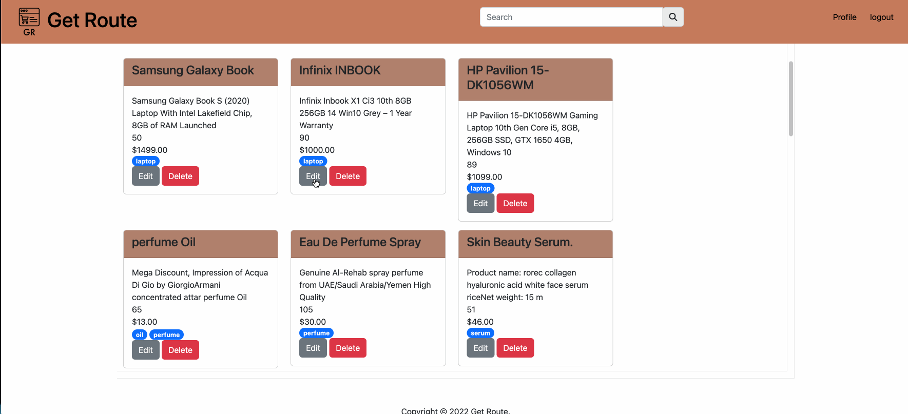

# Get Route

## Description

Get Route is a is an e-commerce website where users can sell, update, review and buy the products.

They can have their own accounts/profiles where they can add,update the product or delete it. Buyer can also add the review for the product. It is a user friendly app, where a buyer can find for the products by using the search or by filter option.

## Deployed Link & Preview

Here is the link to the [deployed application](http://get-route-group-5.herokuapp.com/)

Here is the demo screenshot of the deployed application [demo](./public/pics/Get%20Route.gif)

## Why?

We wanted to create an user-friendly, using mobile responsive ecommerce shopping site for the users.
Given that an online marketplace utilizes a very clear back end and uses all routes, this path offered the most benefit to advancing our knowledge base.

### Features

- Easy to use
- Provide options to the user to add,update and delete a product. A user can also add the review to the products.
- Generates a responsive webpage

## Table of Contents

- [Installation](#installation)
- [Usage](#usage)
- [Technologies Used](#technologies-used)
- [User Stories](#user-stories)
- [Credits](#credits)
- [License](#license)

## Installation

- Create a new repository on your GitHub account.
- Clone this repository.
- Run `npm install`
- Run `mysql -u root -p`
- Run `schema.sql`
- Run `npm start`

## Usage

This project can be used in any web browser or on any devices including the mobile devices.

Following is a code snippet of the application page.

Here it refers to the POST Route for adding a new product by the user.

```Node.js

router.post("/", async (req, res) => {
  try {
    const newProduct = await Product.create({
      ...req.body,
      user_id: req.session.user_id,
    });

    res.status(200).json(newProduct);
  } catch (err) {
    res.status(400).json(err);
  }
});

```

## Technologies Used

- Node.js
- Express.js
- MySQL
- Handlebars
- Sequelize
- Heroku
- Bootstrap
- Sweetalert

## User Stories

- As a user, I would like to buy and sell products.

  

- As a user, I want to be able to add, edit, and delete a product for sale.

  

- As a user, I want to filter the products by tags, so that I can find a product with that tag.

  

- As a user, I want to search a product through a search bar, so I can find a product with the exact name.

  

- As a user, I want to be able to view and add a review on a specific product.

  

## Description of CSS Frameworks Used

## BootStrap

Bootstrap is a free and open-source CSS framework directed at responsive, mobile-first front-end web development. It contains HTML, CSS and JavaScript-based design templates for typography, forms, buttons, navigation, and other interface components.
[Docs](https://getbootstrap.com/docs/5.2/getting-started/introduction/)

## Gif of site at different screen sizes

Mobile version of the app


Tablet version of the app


Desktop version of the app


Large Desktop version of the app


## Learning Objectives

## Collaborators

- Joseph Jensen, GitHub [https://github.com/joedjensen]
- Swetha Pothuganti, GitHub [https://github.com/shwethareddy0]
- William Seban, GitHub [https://github.com/wseban]
- Angel Matias, GitHub [https://github.com/robogf]

## License

This project is licensed under the [MIT](./LICENSE) license.
